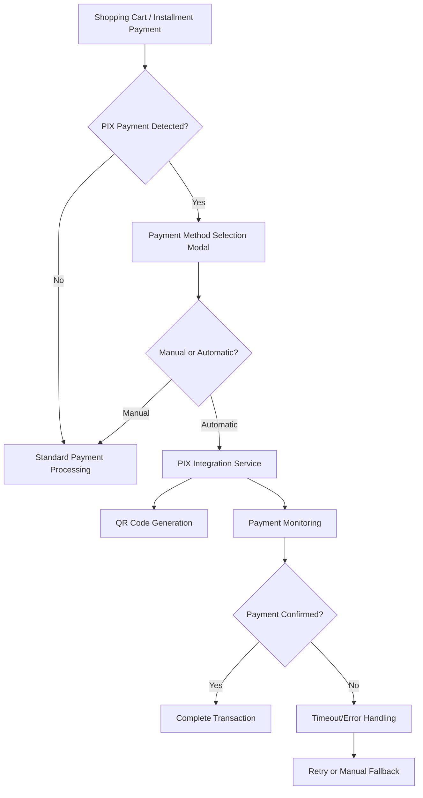

# Design Document

## Overview

The PIX Payment Integration feature will extend the existing JJ Calçados payment system to support automatic PIX payment processing with QR code generation and real-time payment verification. The system will integrate seamlessly with the current shopping cart and installment payment workflows, providing customers with a modern digital payment option while maintaining backward compatibility with existing manual payment processes.

## Architecture

### High-Level Architecture



### System Components

1. **PIX Integration Service** - Core service for PIX operations
2. **QR Code Generator** - Generates PIX QR codes using Brazilian standards
3. **Payment Monitor** - Real-time payment verification system
4. **Configuration Manager** - Manages PIX settings and keys
5. **Transaction Logger** - Comprehensive payment logging
6. **Modal Interface** - User interface for payment method selection

## Components and Interfaces

### 1. PIX Integration Service

**Location:** `app/Services/PixIntegrationService.php`

```php
class PixIntegrationService
{
    public function generatePixPayment(float $amount, string $pixKey): PixPaymentData
    public function generateQRCode(PixPaymentData $paymentData): string
    public function monitorPayment(string $transactionId): PaymentStatus
    public function validatePixKey(string $pixKey): bool
    public function getPaymentStatus(string $transactionId): PaymentStatus
}
```

### 2. PIX Configuration Model

**Location:** `app/Models/PixConfiguration.php`

```php
class PixConfiguration extends Model
{
    protected $fillable = [
        'pix_key',
        'merchant_name',
        'merchant_city',
        'timeout_seconds',
        'enabled',
        'api_endpoint',
        'api_key'
    ];
}
```

### 3. PIX Transaction Model

**Location:** `app/Models/PixTransaction.php`

```php
class PixTransaction extends Model
{
    protected $fillable = [
        'transaction_id',
        'amount',
        'pix_key',
        'qr_code_data',
        'status',
        'payment_type', // 'cart' or 'installment'
        'reference_id', // cart session or parcela ID
        'user_id',
        'created_at',
        'confirmed_at',
        'error_message'
    ];
}
```

### 4. Enhanced Controllers

#### CarrinhoController Extensions

```php
// New methods to add to existing CarrinhoController
public function showPaymentMethodModal(Request $request): JsonResponse
public function processPixPayment(Request $request): JsonResponse
public function checkPixPaymentStatus(string $transactionId): JsonResponse
```

#### PagamentoController Extensions

```php
// New methods to add to existing PagamentoController
public function showInstallmentPixModal(Request $request): JsonResponse
public function processInstallmentPixPayment(Request $request): JsonResponse
```

### 5. Frontend Components

#### Payment Method Selection Modal

**Location:** `resources/views/components/pix-payment-modal.blade.php`

- Modal with "Manual" and "Automático" options
- Integration with existing cart and installment forms
- Real-time status updates

#### QR Code Display Component

**Location:** `resources/views/components/pix-qr-display.blade.php`

- QR code image display
- Payment instructions
- Real-time status monitoring
- Timeout countdown

## Data Models

### PIX Configuration Table

```sql
CREATE TABLE pix_configurations (
    id BIGINT UNSIGNED AUTO_INCREMENT PRIMARY KEY,
    pix_key VARCHAR(255) NOT NULL,
    merchant_name VARCHAR(255) NOT NULL,
    merchant_city VARCHAR(255) NOT NULL,
    timeout_seconds INT DEFAULT 300,
    enabled BOOLEAN DEFAULT true,
    api_endpoint VARCHAR(255),
    api_key VARCHAR(255),
    created_at TIMESTAMP NULL DEFAULT NULL,
    updated_at TIMESTAMP NULL DEFAULT NULL
);
```

### PIX Transactions Table

```sql
CREATE TABLE pix_transactions (
    id BIGINT UNSIGNED AUTO_INCREMENT PRIMARY KEY,
    transaction_id VARCHAR(255) UNIQUE NOT NULL,
    amount DECIMAL(10,2) NOT NULL,
    pix_key VARCHAR(255) NOT NULL,
    qr_code_data TEXT,
    status ENUM('pending', 'confirmed', 'failed', 'timeout') DEFAULT 'pending',
    payment_type ENUM('cart', 'installment') NOT NULL,
    reference_id VARCHAR(255),
    user_id BIGINT UNSIGNED,
    created_at TIMESTAMP NULL DEFAULT NULL,
    confirmed_at TIMESTAMP NULL DEFAULT NULL,
    error_message TEXT,
    FOREIGN KEY (user_id) REFERENCES users(id)
);
```

### Enhanced Existing Tables

No structural changes needed to existing tables. The system will use existing payment fields:
- `valor_pix` in sales tables
- `pix` field in parcelas table

## Error Handling

### Error Types and Responses

1. **Configuration Errors**
   - Missing PIX key
   - Invalid API credentials
   - Network connectivity issues

2. **Payment Processing Errors**
   - QR code generation failure
   - Payment timeout
   - Invalid payment amount

3. **Integration Errors**
   - API service unavailable
   - Malformed responses
   - Authentication failures

### Error Handling Strategy

```php
class PixErrorHandler
{
    public function handleConfigurationError(Exception $e): ErrorResponse
    public function handlePaymentError(Exception $e): ErrorResponse
    public function handleTimeoutError(string $transactionId): ErrorResponse
    public function logError(Exception $e, array $context): void
}
```

### Fallback Mechanisms

1. **Automatic to Manual Fallback** - If PIX integration fails, offer manual processing
2. **Retry Logic** - Allow users to retry failed payments
3. **Session Preservation** - Maintain cart/payment state during errors
4. **Graceful Degradation** - System continues to work without PIX if service is down

## Testing Strategy

### Unit Tests

1. **PIX Integration Service Tests**
   - QR code generation
   - Payment monitoring
   - Configuration validation

2. **Model Tests**
   - PIX configuration validation
   - Transaction state management
   - Relationship integrity

3. **Controller Tests**
   - Payment method selection
   - PIX payment processing
   - Error handling scenarios

### Integration Tests

1. **End-to-End Payment Flow**
   - Cart to PIX payment completion
   - Installment PIX payment flow
   - Error scenarios and fallbacks

2. **API Integration Tests**
   - Mock PIX service responses
   - Network failure scenarios
   - Timeout handling

### Test Data Requirements

```php
// Test PIX Configuration
$testPixConfig = [
    'pix_key' => 'test@example.com',
    'merchant_name' => 'JJ Calçados Test',
    'merchant_city' => 'Tabira',
    'timeout_seconds' => 60,
    'enabled' => true
];

// Test Transaction Data
$testTransaction = [
    'amount' => 100.50,
    'payment_type' => 'cart',
    'reference_id' => 'test-session-id'
];
```

## Implementation Flow

### Cart Payment Flow

1. User fills PIX field manually OR selects PIX discount
2. User clicks "Finalizar Compra"
3. System detects PIX payment and shows modal
4. If "Automático" selected:
   - Generate PIX transaction
   - Create QR code
   - Display QR code to customer
   - Monitor payment status
   - Complete sale when confirmed

### Installment Payment Flow

1. User fills PIX field in installment payment
2. User submits payment form
3. System detects PIX payment and shows modal
4. If "Automático" selected:
   - Generate PIX transaction for installment amount
   - Create QR code
   - Display QR code to customer
   - Monitor payment status
   - Update parcela when confirmed

### Configuration Management

1. Admin interface for PIX settings
2. PIX key validation and testing
3. Enable/disable PIX functionality
4. Timeout and retry configuration

## Security Considerations

### Data Protection

1. **PIX Key Security** - Encrypt stored PIX keys
2. **Transaction Integrity** - Validate all payment amounts
3. **Session Security** - Secure payment session data
4. **API Security** - Secure API communications with encryption

### Validation Rules

```php
// PIX Key Validation
$pixKeyRules = [
    'email' => 'email:rfc,dns',
    'cpf' => 'cpf',
    'cnpj' => 'cnpj',
    'phone' => 'phone:BR',
    'random_key' => 'uuid'
];

// Payment Amount Validation
$amountRules = [
    'min' => 0.01,
    'max' => 99999.99,
    'decimal_places' => 2
];
```

### Audit Trail

All PIX transactions will be logged with:
- User identification
- Transaction amounts
- Timestamps
- Status changes
- Error details

## Performance Considerations

### Optimization Strategies

1. **Caching** - Cache QR codes for identical payments
2. **Async Processing** - Non-blocking payment monitoring
3. **Database Indexing** - Optimize transaction queries
4. **Connection Pooling** - Efficient API connections

### Monitoring Metrics

1. **Payment Success Rate** - Track successful PIX payments
2. **Response Times** - Monitor API response times
3. **Error Rates** - Track and alert on error patterns
4. **User Experience** - Monitor payment completion times

## Integration Points

### Existing System Integration

1. **CarrinhoController** - Extend existing finalization logic
2. **PagamentoController** - Extend installment payment processing
3. **Session Management** - Integrate with existing cart sessions
4. **Database Tables** - Use existing payment fields

### External Service Integration

1. **PIX Service Provider** - Integration with Brazilian PIX network
2. **QR Code Library** - Use standard QR code generation
3. **Real-time Monitoring** - WebSocket or polling for payment status

### Configuration Integration

1. **Laravel Config** - PIX settings in config files
2. **Environment Variables** - Secure credential management
3. **Database Configuration** - Runtime PIX settings management